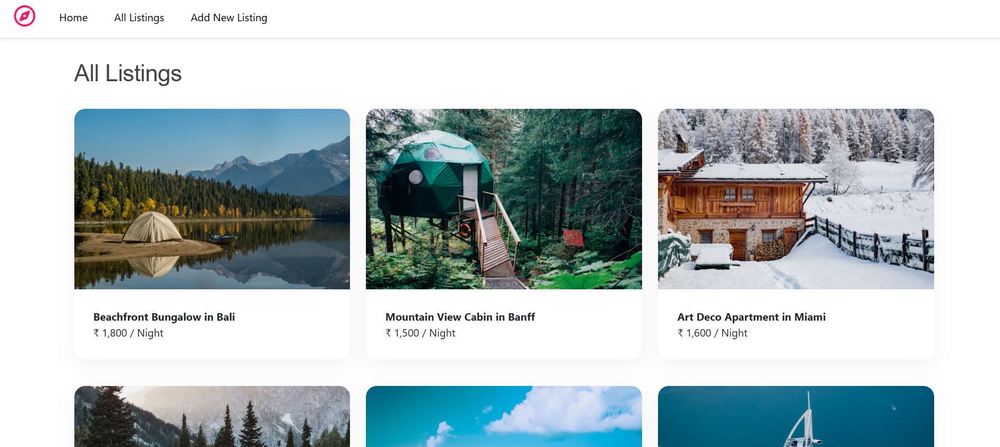
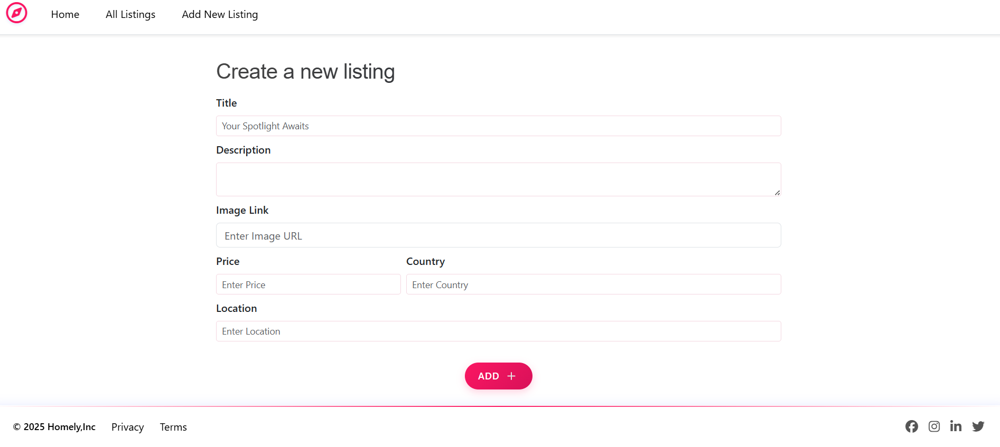
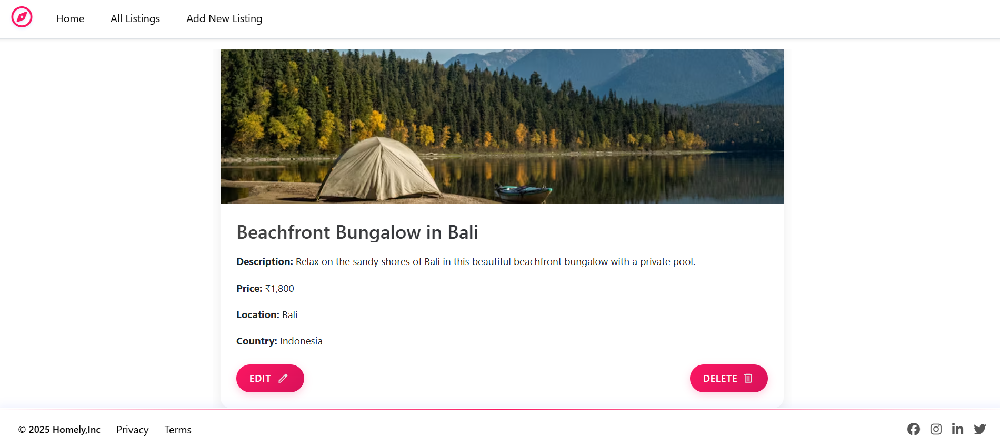

# Homely

Homely is a web application for property listings, similar to Airbnb. It allows users to browse, create, edit, and delete property listings.

## Screenshots

### All Listings Page
The main page displaying all available property listings in a responsive grid layout with beautiful property images, titles, and pricing.



### Create New Listing Form
A comprehensive form for adding new property listings with fields for title, description, image URL, price, location, and country.



### Individual Listing Details
Detailed view of a specific property showing full-size images, complete description, pricing, location details, and action buttons for editing or deleting.



## Features

- View all property listings
- View detailed information about a specific listing
- Create new property listings
- Edit existing property listings
- Delete property listings
- Form validation for creating and editing listings

## Technologies Used

- **Backend**:
  - Node.js
  - Express.js
  - MongoDB with Mongoose
  - EJS (Embedded JavaScript) for templating
  - EJS-Mate for layout management
  - Joi for data validation

- **Frontend**:
  - HTML/CSS
  - Bootstrap 5 for responsive design
  - JavaScript
  - Font Awesome for icons

## Installation

1. Clone the repository:
   ```bash
   git clone <repository-url>
   cd Homely
   ```

2. Install dependencies:
   ```bash
   npm install
   ```

3. Make sure MongoDB is installed and running on your system.

4. Start the application:
   ```bash
   node app.js
   ```

5. Open your browser and navigate to `http://localhost:8080`

## Project Structure

```
Homely/
├── models/             # Database models
│   ├── listing.js      # Listing model
│   └── review.js       # Review model
├── public/             # Static files
│   ├── css/            # CSS files
│   └── js/             # JavaScript files
├── utils/              # Utility functions
│   ├── ExpressError.js # Custom error handling
│   └── wrapAsync.js    # Async error wrapper
├── views/              # EJS templates
│   ├── includes/       # Reusable template parts
│   ├── layouts/        # Layout templates
│   └── listings/       # Listing-related templates
├── app.js              # Main application file
├── package.json        # Project dependencies
└── schema.js           # Joi validation schemas
```

## Usage

### Viewing Listings

- Navigate to `/listings` to see all available property listings
- Click on any listing to view its details

### Creating a Listing

1. Navigate to `/listings/new`
2. Fill out the form with the property details
3. Click "Create" to add the new listing

### Editing a Listing

1. Navigate to a specific listing's page
2. Click the "Edit" button
3. Modify the details in the form
4. Click "Update" to save changes

### Deleting a Listing

1. Navigate to a specific listing's page
2. Click the "Delete" button to remove the listing

## API Routes

- `GET /listings` - View all listings
- `GET /listings/new` - Form to create a new listing
- `POST /listings` - Create a new listing
- `GET /listings/:id` - View a specific listing
- `GET /listings/:id/edit` - Form to edit a listing
- `PUT /listings/:id` - Update a listing
- `DELETE /listings/:id` - Delete a listing

## Data Models

### Listing Model

```javascript
{
  title: String,  
  description: String,
  image: {
    filename: String,
    url: String
  },
  price: Number,
  location: String,
  country: String,
  reviews: [    
    {
      type: ObjectId,
      ref: 'Review'
    }
  ]
}
```

## Error Handling

The application includes custom error handling middleware that catches and processes errors, displaying user-friendly error messages.

## Contributing

1. Fork the repository
2. Create your feature branch (`git checkout -b feature/amazing-feature`)
3. Commit your changes (`git commit -m 'Add some amazing feature'`)
4. Push to the branch (`git push origin feature/amazing-feature`)
5. Open a Pull Request

## License

This project is licensed under the ISC License - see the LICENSE file for details.

## Screenshots Information

To add your own screenshots to this README:

1. **Save your screenshots** in the `screenshots/` folder with these names:
   - `all-listings.png` - Screenshot of the main listings page
   - `create-listing.png` - Screenshot of the create new listing form
   - `listing-details.png` - Screenshot of an individual listing detail page

2. **Image formats supported**: PNG, JPG, GIF, WebP
3. **Recommended size**: Keep images under 1MB for faster loading
4. **Markdown syntax**: ``

## Acknowledgements

- Bootstrap for the responsive design framework
- Font Awesome for the icons
- MongoDB for the database
- Express.js for the web framework
